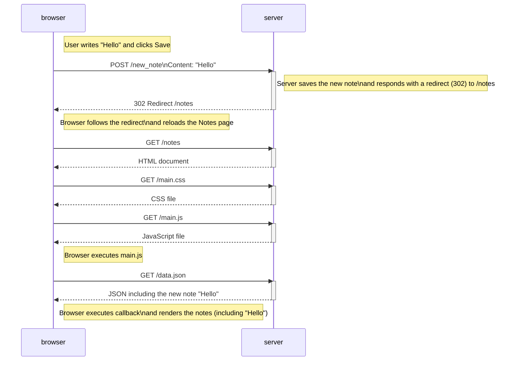

# Sequence Diagram – Creating a New Note ("Hello")

The following diagram illustrates what happens when the user types **"Hello"** into the text field on  
https://studies.cs.helsinki.fi/exampleapp/notes  
and clicks the **Save** button.

